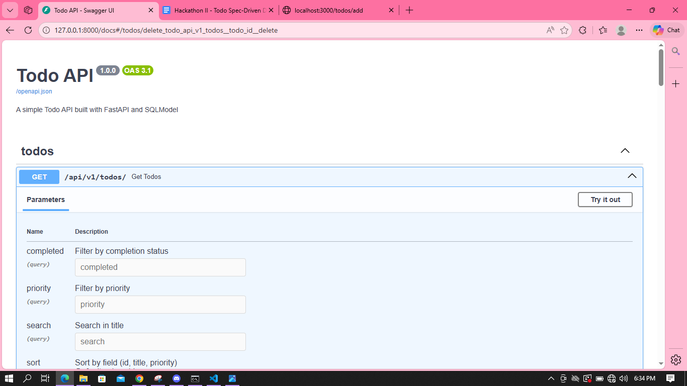
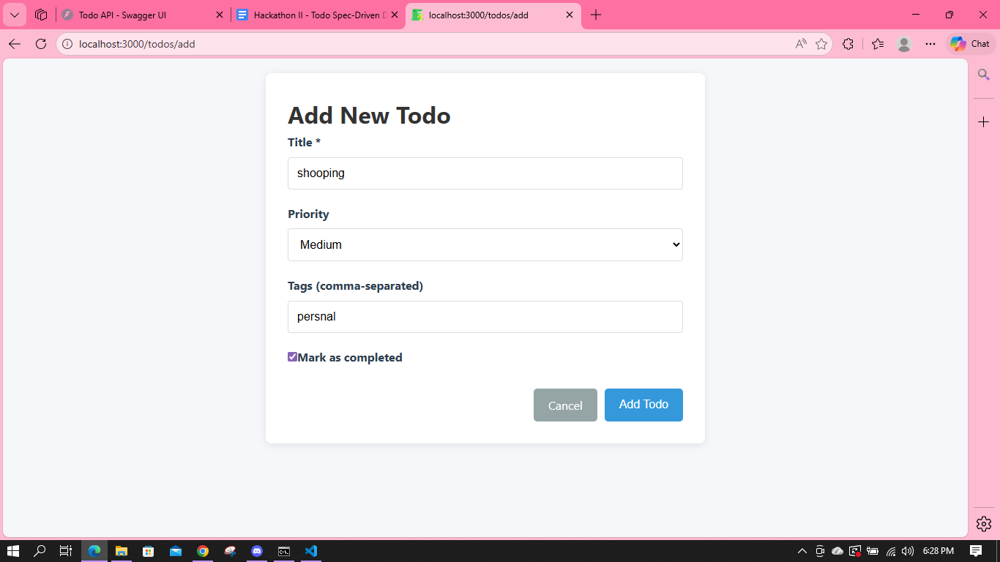

 Phase II – Full-Stack Todo Web Application

  Phase Overview

  Phase II of the "Evolution of Todo" project transforms the console-based Todo application from Phase I into a  
  full-stack web application. This phase introduces persistent data storage, a modern web interface, and enhanced
  functionality while maintaining the core Todo management capabilities.

  Tech Stack

   - Frontend: Next.js
   - Backend: FastAPI
   - Database: PostgreSQL (Neon Serverless)
   - ORM: SQLModel
   - Frontend Dependencies: React, Axios
   - Backend Dependencies: Pydantic, Uvicorn

  Features

   - Add Todo: Create new todos with title, priority, and tags
   - View Todos: Display all todos with visual indicators for completion status
   - Update Todo: Modify existing todo details
   - Delete Todo: Remove todos from the list
   - Mark Todo as Complete: Toggle completion status with visual feedback
   - Search Todos: Find todos by title
   - Filter Todos: Filter by status (completed/pending), priority (High/Medium/Low), and tags
   - Sort Todos: Sort by title, priority, or ID in ascending/descending order

  Project Structure

    1 todo-app/
    2 ├── backend/
    3 │   ├── app/
    4 │   │   ├── api/
    5 │   │   ├── models/
    6 │   │   ├── database/
    7 │   │   └── config/
    8 │   ├── requirements.txt
    9 │   └── alembic.ini
   10 ├── frontend/
   11 │   ├── pages/
   12 │   ├── components/
   13 │   ├── styles/
   14 │   ├── public/
   15 │   ├── package.json
   16 │   └── next.config.js
   17 ├── .env
   18 ├── CONSTITUTION.md
   19 └── SPEC.md

   - backend/: Contains the FastAPI application with API routes, database models, and configuration
   - frontend/: Contains the Next.js application with pages, components, and styling

   

  How to Run Locally
  "

  Backend Setup     

   1. Navigate to the backend directory:

   1    cd todo-app/backend

   2. Create and activate a virtual environment:

   1    python -m venv .venv
   2    source .venv/bin/activate  # On Windows: .venv\Scripts\activate

   3. Install dependencies:

   1    pip install -r requirements.txt

   5. Start the backend server:

   1    uvicorn app.main:app --reload

  Frontend Setup

   1. Navigate to the frontend directory:

   1    cd todo-app/frontend

   2. Install dependencies:

   1    npm install

   3. Start the development server:

   1    npm run dev

   4. Access the application at http://localhost:3000

  API Overview

  The backend provides a RESTful API with the following endpoints:

   - GET /api/v1/todos - Retrieve all todos with optional filtering and sorting
   - POST /api/v1/todos - Create a new todo
   - GET /api/v1/todos/{id} - Retrieve a specific todo
   - PUT /api/v1/todos/{id} - Update a specific todo
   - DELETE /api/v1/todos/{id} - Delete a specific todo
   - PATCH /api/v1/todos/{id}/complete - Toggle completion status of a todo
   - GET /health - Health check endpoint

  Screenshots

  Placeholder for application screenshots

  Notes & Limitations

   - No Authentication: This phase does not include user authentication or authorization
   - No AI Features: AI capabilities will be added in Phase III
   - Local Development: Uses SQLite for local development; PostgreSQL for production

  License

  This project is part of the "Evolution of Todo" hackathon and is provided for educational purposes.